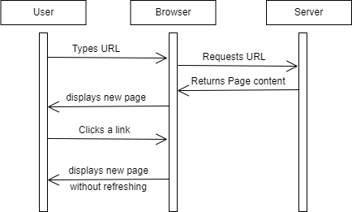

+++
pre = '<b>5. </b>'
title = "React Router"
weight = '500'
draft = false 
+++

Dans le développement web, le routage fait souvent référence à la division de l'interface utilisateur d'une application sur la base de règles dérivées de l'URL du navigateur. Imaginez que vous cliquez sur un lien et que l'URL passe de `https://exemple.com` à `https://exemple.com/about/`. C'est ce qu'on appelle le routage.

Lorsque nous visitons le chemin `/` d'un site web, nous avons l'intention de visiter la page d'accueil de ce site. Si nous visitons `/about`, nous voulons afficher la page "À propos", et ainsi de suite.

De nombreuses applications peuvent techniquement être écrites sans routage, mais cela peut devenir compliqué au fur et à mesure que l'application se développe. La définition de routes dans une application est utile car elle permet de séparer différentes zones d'une application et de protéger des zones de l'application sur la base de certaines règles.

### Bases du routage
Le routage est souvent classé en deux catégories principales :

+ Routage côté serveur
+ Routage côté client

#### Routage côté serveur

Dans une application pilotée par le serveur, les demandes d'URL suivent souvent un schéma :
1. Le client (i.e. le navigateur) demande au serveur une page particulière.
2. Le serveur reçoit la requête
3. Le serveur remplit un modèle (document HTML).
4. Le serveur renvoie le modèle au client avec d'autres éléments tels que des feuilles de style CSS ou des images.
5. Le client (navigateur) effectue le rendu de ces ressources.
6. Si le client clique sur un lien qui change l'URL vers une autre route, le client envoie une nouvelle demande au serveur, et la procédure ci-dessus est répétée.

#### Routage côté client


Dans les applications utilisant le routage côté client, le serveur fournit initialement un seul fichier HTML, quel que soit le chemin d'accès à l'URL. La navigation entre les différentes parties de l'application n'envoie pas de nouvelles demandes au serveur, mais modifie le contenu affiché en fonction du code JavaScript et des données chargées.

Le flux de routage côté client se présente généralement comme suit :

1. Le client adresse une demande initiale au serveur.
2. Le serveur répond avec un document HTML primaire (la page unique de la SPA) et les ressources associées (par exemple, JavaScript, CSS).
3. Le client interprète le JavaScript et la logique de l'application détermine le contenu à afficher en fonction du chemin d'accès à l'URL.
4. Pour les changements de route, le JavaScript met à jour l'historique du navigateur et le contenu affiché sans qu'il soit nécessaire de recharger complètement la page.

Le routage côté client peut être mis en œuvre à l'aide de plusieurs librairies. Dans le cadre de ce cours, nous allons apprendre les bases de l'utilisation de `React Router` : une bibliothèque de routage côté client populaire pour les applications React.

### Configuration de React Router & BrowserRouter

#### Installation
Pour commencer à utiliser React Router, il faut d'abord l'ajouter aux dépendances de notre application, et l'installer :

```bash
npm install react-router-dom
```

Observez les changements apportés dans les fichiers `package.json` et `package-lock.json` (qui listent les dépendances de notre application).

Ensuite, pour commencer à utiliser cette librairie, il faut "envelopper" notre composant principal (`App.jsx`) avec le Contexte `<BrowserRouter></BrowserRouter>`  comme suit :

Pour en savoir plus sur les contexte React, référez-vous à la [documentation React](https://fr.legacy.reactjs.org/docs/context.html#contextprovider)

```jsx
import { BrowserRouter } from "react-router-dom"

function App() {
  return (
    <h1>Hello world!</h1>
  )
}

ReactDOM.createRoot(document.getElementById('root')).render(
  <BrowserRouter>
    <App />
  </BrowserRouter>
);
```

### Routes

```jsx
import { BrowserRouter, Routes, Route } from "react-router-dom"

function App() {
  return (
    <h1>Hello, React Router!</h1>
  )
}

ReactDOM.createRoot(document.getElementById('root')).render(
  <BrowserRouter>
    <Routes>
      <Route path="/" element={<App />} />
    </Routes>
  </BrowserRouter>
);
```

#### Exercice
 1. Créer un composant `<About />` (avec seulement un h1 qui dit
 "Page à propos" ou quelque chose de plus intéressant de votre choix).
 2. Créer une nouvelle route pour *render* le composant `<About />` lorsque le chemin d'accès est `/about`

 <!-- QUICK REORG
import { BrowserRouter, Routes, Route } from "react-router-dom"

function App() {
  return (
    <BrowserRouter>
      <Routes>
        <Route path="/" element={<Home />} />
        <Route path="/about" element={<About />} />
      </Routes>
    </BrowserRouter>
  )
}

function Home() {
  return (
    <h1>Hello, React Router!</h1>
  )
}

function About() {
  return (
    <h1>About page goes here! 🎉</h1>
  )
}

ReactDOM
  .createRoot(document.getElementById('root'))
  .render(<App />);
  -->

### Link
<!-- similar to an anchor tag <a> mais ça garde le state quand on change de route, au lieu de href= on utlise to= -->
```jsx
import { BrowserRouter, Routes, Route, Link } from "react-router-dom"

function App() {
  return (
    <BrowserRouter>
      <nav>
        <Link to="/">Accueil</Link>
        <Link to="/about">À Propos</Link>
      </nav>
      <Routes>
        <Route path="/" element={<Home />} />
        <Route path="/about" element={<About />} />
      </Routes>
    </BrowserRouter>
  )
}

function Home() {
  return (
    <h1>Hello, React Router!</h1>
  )
}

function About() {
  return (
    <h1>Page à propos! 🎉</h1>
  )
}

ReactDOM
  .createRoot(document.getElementById('root'))
  .render(<App />);
```